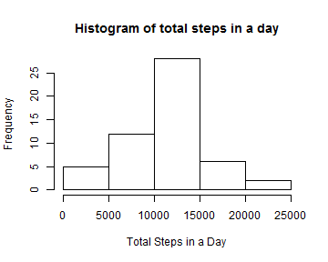
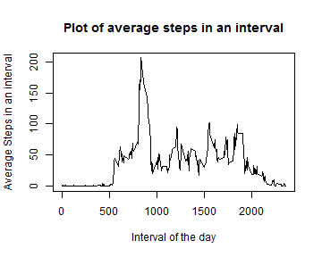
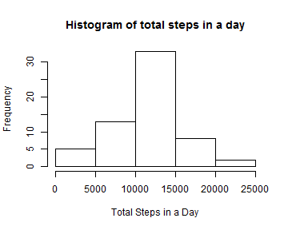
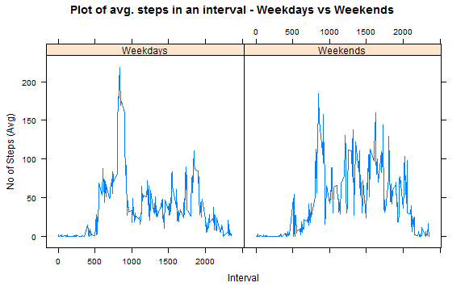

## Personal Activity Monitoring & Analysis
========================================================
### Introduction
Today we can leverage technology to monitor personal activity on an ongoing basis. In this exercise we consider data from a personal activity monitoring device that collected data - of number of steps of an anonymous individual -  at 5 minute intervals throughout the day, over two month period (October and November,2012).
### Objective
The objective of this exercise is to understand the activity patterns of a specific individual across days, through the day and identify differences, if any, in activity levels between weekdays and weekends.
### Loading and preprocessing the data
In this step we will load the data, after having already set the directory and loading knitr package.


```r
activity = read.csv("activity.csv", colClasses = c("numeric", "Date", "numeric"))
```

### Data Analysis I ( Total number of steps in a day)
In this part of the analysis we examine the total number of steps that the individual takes in a day and calculate their mean and median value. We note that the total number of steps taken on any given day ranges from 0 to 25000. Also, the mean and median values are very close to each other - 10766 and 10765 respectively.

```r
totalsteps = tapply(activity$steps, activity$date, sum)
hist(totalsteps, main = "Histogram of total steps in a day", xlab = "Total Steps in a Day")
```

 

```r
mean(totalsteps, na.rm = T)
```

```
## [1] 10766
```

```r
median(totalsteps, na.rm = T)
```

```
## [1] 10765
```

### Data Analysis II ( Daily activity pattern)
Here we analyse activity levels within a day.We observe that the total number of steps that the individual takes in a 5 minute interval ranges from 0 to 200. Also the maximum of the average steps taken is 206.1698 in the "835"" interval. 

```r
intervalsteps = tapply(activity$steps, activity$interval, mean, na.rm = T)
plot(unique(activity$interval), intervalsteps, main = "Plot of average steps in an interval", 
    ylab = "Average Steps in an interval", xlab = "Interval of the day", type = "l")
```

 

```r
which(intervalsteps == max(intervalsteps), arr.ind = TRUE)
```

```
##     dim1
## 835  104
```

```r
intervalsteps[104]
```

```
##   835 
## 206.2
```

### Data Analysis III ( Imputing Missing Values)
In this part of the analysis we examine the extent of missing data and try to impute values so as to make the dataset complete ( i.e.without any NAs).We discover that out of 17568 observations, 2304 observations donot have any data under the "steps"column.All other data exists.

```r
apply(activity, 2, function(x) length(which(is.na(x))))
```

```
##    steps     date interval 
##     2304        0        0
```

We will use the mice package to impute missing values under the step column.The other columns are predictors for the missing values.The iterations and the outputs while deriving the dataset without NAs is supressed as it would run into many lines (which donot add any usefule information to the reader)
.

```r
set.seed(144)
library(mice)
```

```
## Loading required package: Rcpp
## mice 2.21 2014-02-05
```

```r
activityimp = activity
activityimp$date = as.numeric(activityimp$date)
activityimp = complete(mice(activityimp))
```

We now confirm below that the dataset is complete and recompute the total steps in a day as well as their mean and median. We compare these values with those calculated earlier by ignoring NAs and find that
1. Overall range of values for total steps on any given day remains as before at between 0 to 25000
2. However, the mean and median are higher at 11091 and 11273 respectively as opposed to 10766 and 10765.

```r
apply(activityimp, 2, function(x) length(which(is.na(x))))
```

```
##    steps     date interval 
##        0        0        0
```

```r
totalstepsimp = tapply(activityimp$steps, activityimp$date, sum)
hist(totalstepsimp, main = "Histogram of total steps in a day", xlab = "Total Steps in a Day")
```

 

```r
mean(totalstepsimp, na.rm = T)
```

```
## [1] 11091
```

```r
median(totalstepsimp, na.rm = T)
```

```
## [1] 11273
```

### Data Analysis IV (Differences in activity patterns between weekdays and weekends)
There is a significant difference in activity levels during weekdays and weekends, with average number of steps in an interval being 44.32 during weekends and 36.44 during weekdays.In addition we notice that the no of steps on weekends are higher across the set of intervals through the day, whereas on weekdays these tend to be higher during the initial intervals. 

```r
activity$steps <- activityimp$steps
activity$weekdays = weekdays(activity$date)
activity$weekday = ifelse(activity$weekdays == "Saturday" | activity$weekdays == 
    "Sunday", "Weekends", "Weekdays")
library(plyr)
a = ddply(activity, .(interval, weekday), summarize, avsteps = mean(steps))
tapply(a$avsteps, as.factor(a$weekday), mean)
```

```
## Weekdays Weekends 
##    36.44    44.33
```

```r
library(lattice)
xyplot(avsteps ~ interval | weekday, data = a, type = "l", xlab = "Interval", 
    ylab = "No of Steps (Avg)", main = "Plot of avg. steps in an interval - Weekdays vs Weekends")
```

 

### Conclusion
The monitoring and analysis of activities gives us useful insights into the behavour of individuals and could give us further insights when analyzed across different professions.
